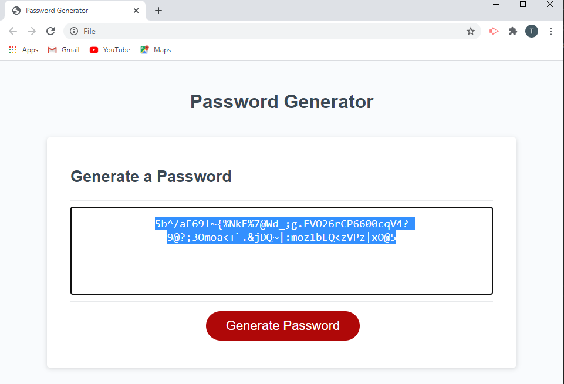

# Password Generator site.

## Context

This site is the homework assignment for the week 3 of the full-stack flex program. The aim of this home work is to write javascript code to generate a password. The user is given options of the number of characters in the password (between 8 and 128), and what kind of characters (upper case, lower case, digits and special characters) are to appear in the password.



## Acceptance Criteria (from the assignment)

```
...
WHEN prompted for the length of the password
THEN I choose a length of at least 8 characters and no more than 128 characters
WHEN prompted for character types to include in the password
THEN I choose lowercase, uppercase, numeric, and/or special characters
WHEN I answer each prompt
THEN my input should be validated and at least one character type should be selected
...
THEN the password is either displayed in an alert or written to the page
```


## Deviations from the Acceptance criteria

The code as written deviates from the acceptance criteria given above 

1. The length criteria is chosen first.
    1. If the user clicks on cancel during the select length criteria, then procedure exits and nothing is written to the web page.
    2. If the user enters text, it alerts the user and loops back.
    3. If the user enters a number outside the required range, then it alerts the user and loops back.
2. The password is only written to the page, not an alert dialog. 
3. The CSS for the password text has been auto-selected to highlight any spaces in the password, and to allow easy copy and paste 


